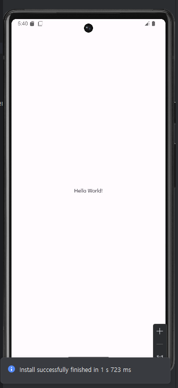

## 안드로이드 세미나

- 강의 시간: 월요일 17:30
- 강의자: 정해찬(@qdrptd)

## 과제 0

### 안드로이드 스튜디오 설치하기
- 설치가 완료되어 Hello World!가 표시된 화면을 캡쳐해서 첨부해 주세요.

### Kotlin과 친해지기
- Kotlin 공식 문서를 읽고, 다른 언어에서 보지 못했던 문법이나 새로 알게 된 문법이 있다면 작성해 주세요.
- Kotlin 언어의 장점이 무엇인지도 검색해서 찾아 주세요. (gpt가 잘 합니다.)
Kotlin에서는 fun 키워드를 사용한다는 점, 그리고 val 과 var을 구분하여서 불변하는 변수와 가변하는 변수를 구분하는 것이 새로웠습니다. 
Kotlin의 장점으로는 간결하고 읽기 쉬우며, 자바와 100% 호환된다는 점이 있습니다. 자바와의 다른점은 변수가 null을 가질 수 있는지 여부를 타입에 표시하도록 해서, 더욱 안전하게 null을 처리할 수 있도록 도와준다고 합니다. 

### PR 날리기
- 본 레포지토리를 Fork한 후, assignment-0 브랜치를 파서 과제를 완료해 주세요.
- 이후 your-repository/assignment-0 -> seminar-2025-android-assignment/main으로 PR을 날려 주세요.
