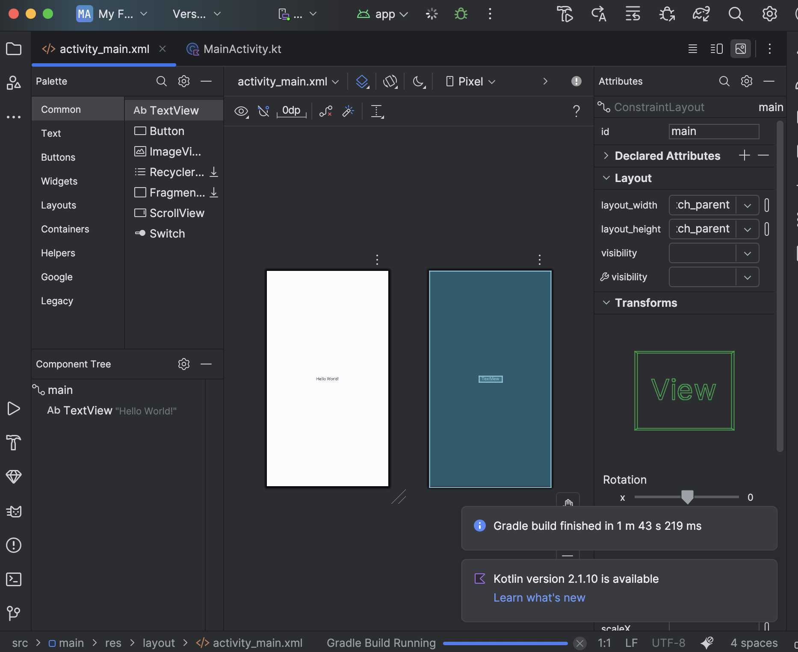

## 안드로이드 세미나

- 강의 시간: 월요일 17:30
- 강의자: 정해찬(@qdrptd)

## 과제 0

### 안드로이드 스튜디오 설치하기
- 설치가 완료되어 Hello World!가 표시된 화면을 캡쳐해서 첨부해 주세요.

### Kotlin과 친해지기
Kotlin 공식 문서를 읽고, 다른 언어에서 보지 못했던 문법이나 새로 알게 된 문법이 있다면 작성해 주세요. 스마트 캐스트(Smart cast) is로 타입 체크 후 블록 내부에서 자동 캐스팅 인라인 + reified 제네릭 inline fun

Kotlin 언어의 장점이 무엇인지도 검색해서 찾아 주세요. (gpt가 잘 합니다.) • 안전성: 널 안정성 + 스마트 캐스트 + 봉인 계층으로 런타임 오류를 줄이고, 컴파일 타임 검증을 강화 • 생산성/간결성: 데이터 클래스, 확장 함수/프로퍼티, 디폴트/네임드 인자, DSL 등으로 보일러플레이트를 대폭 축소

### PR 날리기
- 본 레포지토리를 Fork한 후, assignment-0 브랜치를 파서 과제를 완료해 주세요.
- 이후 your-repository/assignment-0 -> seminar-2025-android-assignment/main으로 PR을 날려 주세요.
